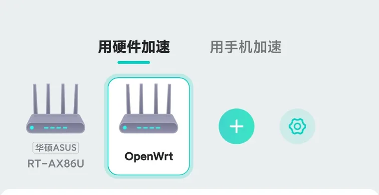

# UU Remote WOL Router Helper｜网易 UU远程开机路由器辅助设备

> 非官方社区项目 / Unofficial community project. Not affiliated with NetEase.

这是一个面向 **网易 UU远程开机 / Wake-on-LAN（WOL）** 的路由器辅助设备项目。针对官方没有直接提供插件入口、但具备 **OpenWrt / iStoreOS / XiaoQiang（小米/Redmi 路由器）** 等环境和合法 SSH/root 权限的设备，提供平台诊断、网易官方包校验、受控安装与回滚；ASUSWRT 则优先识别并引导使用厂商/网易官方集成。

当前真实验证样本包括 **Redmi AX6000 / RB06、ASUS RT-AX86U、iStoreOS x86_64**。其它 Generic OpenWrt 设备仍需逐台验证，不因架构相同自动继承兼容结论。

## 先看这里：你的路由器可能根本不需要本项目

**第一件事不是敲命令，而是先用网易 UU 主机加速器检查你的路由器能不能直接走官方方案。**

手机先连接到这台路由器的 Wi‑Fi，然后打开 **网易 UU 主机加速器**：

1. 点 **“路由器加速”**；
2. 点 **“合作款路由器”**；
3. 扫描 / 添加当前路由器；
4. 如果能识别到你的型号，就优先按 UU 的官方提示完成绑定或插件安装，**不要使用本项目**；
5. 完成后再回到 **UU远程 → 远程开机配置**，重新扫描 / 刷新辅助设备。

> **账号一定要对上：** 手机里的 **网易 UU 主机加速器** 和 Windows 电脑上的 **UU远程** 必须处于正确的同一账号关系。我们真实排障时就遇到过“路由器插件已经在线、UU主机加速器也能看到路由器，但 UU远程仍提示没有辅助设备”的情况，最后问题就在账号关系没有对应正确。
>
> 在 UU 主机加速器里这里找的是 **“合作款路由器”**，不要点成“UU加速盒 / Steam 硬件 / UU加速棒”。

官方说明：

- **网易官方：华硕、小米路由器怎么装 UU 插件来辅助开机？** <https://www.uuremotepro.com/faq-article?id=wol-plugin>
- **网易官方：哪些路由器能当远程开机的辅助设备？** <https://www.uuremotepro.com/faq-article?id=wol-router>
- 如果上面的直达页发生跳转，可进入 **网易 UU远程帮助中心** <https://www.uuremotepro.com/faq>，搜索：`哪些路由器能当远程开机的辅助设备？`
- **网易官方完整远程开机教程：** <https://www.uuremotepro.com/faq-article?id=wol-setup>

### 怎么选？

| 你的情况 | 最省事的做法 |
|---|---|
| 路由器在网易官方支持列表里 | **直接用官方方法，本项目不用装** |
| 路由器不支持，但家里有常开 Android / Windows / macOS | **优先把它当 UU 辅助设备，本项目也可以不用装** |
| 运营商光猫/封闭路由器，没有 SSH/root | **不要硬刷，改用 Android / 常开电脑辅助设备** |
| OpenWrt / iStoreOS / XiaoQiang，已有合法 SSH/root | 可以继续看下面的本项目教程 |

网易官方说明中，局域网辅助设备并不只有路由器，也可以是保持在线的 Windows/macOS、开启 WOL 辅助功能的 Android，或 UU 加速盒。因此**能用官方简单方案，就不要为了使用本项目去破解或刷路由器。**

---

# 小白教程：只看这 3 步

## 第 1 步：先把电脑自己的 WOL 配好

在需要远程开机的 Windows 电脑上：

1. 打开 **UU远程**；
2. 进入设置，开启 **“允许通过远程开机启动”**；
3. 按 UU远程里的“开始配置 / 开始协助”向导，把网卡 WOL 和 BIOS WOL 配好；
4. 电脑最好使用**有线网卡**连接路由器。

这一步不会因为装了路由器插件而自动完成。电脑本身不能被 Magic Packet 唤醒，后面怎么折腾路由器都没用。

官方图文教程：<https://www.uuremotepro.com/faq-article?id=wol-setup>

## 第 2 步：准备一个一直在线的“辅助设备”

### A. 官方支持的路由器

如果你的型号在网易官方列表里：

**按官方方法安装/开启 UU 插件即可，下面的命令全部跳过。**

### B. 没有 SSH/root 的路由器或运营商光猫

不要硬装本项目。

最简单的是：找一台旧 Android 手机，长期插电并连接家里 Wi‑Fi，在 UU远程 App 的设置中开启 **“远程开机支持 Wake on LAN”**。也可以使用另一台常开的 Windows/macOS。

### C. OpenWrt / iStoreOS / XiaoQiang，且你已经有 SSH/root

先把本仓库放到路由器的 `/tmp`。

最简单的方法：电脑端点击 GitHub 的 **Code → Download ZIP**，解压后用 WinSCP / SCP 上传整个目录到：

```text
/tmp/uu-remote-wol-router-helper
```

如果路由器本身有 Git，也可以：

```sh
git clone https://github.com/coolhpj/uu-remote-wol-router-helper.git /tmp/uu-remote-wol-router-helper
```

然后 SSH 进入路由器，执行：

```sh
cd /tmp/uu-remote-wol-router-helper
sh uu-helper.sh diagnose
```

只看输出里的这一行：

```text
platform: ...
```

### 如果显示 `platform: asuswrt`

**停止。** ASUSWRT 优先走厂商/网易官方集成，本项目不会自动覆盖 `/jffs/uu`。

### 如果显示 `platform: unknown`

**停止，不要猜型号安装。** 只运行：

```sh
sh uu-helper.sh collect-info
```

把脱敏后的输出提交 Issue，等待适配。

### 如果显示 `platform: openwrt`

把下面这一整块复制执行即可：

```sh
sh uu-helper.sh preflight && \
sh uu-helper.sh stage auto && \
UU_RUNTIME_TEST_CONFIRM=TEMPORARY_RUNTIME_CHANGE sh platforms/openwrt/smoke-test.sh && \
UU_PERSIST_INSTALL_CONFIRM=PERSIST_OPENWRT_UU sh platforms/openwrt/install.sh
```

这组命令使用 `&&` 串联：**任何一步失败，后面的步骤都会停止。** 不要跳过失败步骤硬装。

需要恢复安装前状态时：

```sh
sh platforms/openwrt/rollback.sh
```

### 如果显示 `platform: xiaoqiang`

当前只支持**已有 Xiaomi/UU legacy metadata 的受控迁移路径**，不是所有小米/Redmi 路由器都能直接安装。

复制执行：

```sh
sh uu-helper.sh preflight && \
sh uu-helper.sh stage auto && \
UU_RUNTIME_TEST_CONFIRM=TEMPORARY_RUNTIME_CHANGE sh platforms/xiaoqiang/smoke-test.sh && \
UU_XQ_INSTALL_CONFIRM=MIGRATE_XIAOQIANG_UU sh platforms/xiaoqiang/install.sh
```

如果提示已有 UU runtime、legacy metadata 不完整或其它错误，**到这里停止，不要手工伪造文件或随便加确认参数。**

需要回滚：

```sh
sh platforms/xiaoqiang/rollback.sh
```

## 第 3 步：先用手机绑定路由器，再测试“人在外面开机”

如果第 2 步使用本项目完成了持久安装，建议先**手工重启一次路由器**，确认持久安装真的能在冷启动后恢复。

> `/tmp` 通常会在 reboot 后被清空，所以**不要指望重启后仓库目录还在**。普通用户不需要为了验收再次上传仓库；如果后续需要 SSH 技术诊断，再重新把仓库上传到 `/tmp` 后运行 `sh uu-helper.sh diagnose`。

### 3.1 先安装手机端「网易 UU 主机加速器」

这一步很重要：**手机上需要的是「网易 UU 主机加速器」，不是 Windows 上的「UU远程」。这两个是不同客户端。**

1. 在手机应用商店搜索并安装 **网易 UU 主机加速器**；
2. 登录后，手机先连接到家里这台路由器的 **Wi‑Fi**；
3. 进入 **路由器加速 → 合作款路由器 → 扫描 / 添加路由器**；
4. 能识别到当前路由器后，按页面提示完成绑定或插件识别。

> 在「网易 UU 主机加速器」里要找的是 **合作款路由器**，不要点成“UU加速盒 / Steam 硬件 / UU加速棒”。

### 3.2 再确认账号对应关系

> 手机 **网易 UU 主机加速器** 登录的账号，必须和 Windows **UU远程** 当前使用的账号正确对应。否则即使路由器里的 `uuplugin` 已经联网、手机也能识别路由器，Windows UU远程仍可能找不到辅助设备。

### 3.3 回到 Windows UU远程刷新辅助设备

1. 打开 Windows **UU远程 → 远程开机配置**；
2. 重新扫描 / 刷新辅助设备；
3. 确认刚才绑定的路由器已经出现在辅助设备里；
4. 给**每一台需要远程开机的 PC 分别配置一次远程开机**。

### 3.4 最后做真正的外网测试

1. 正常关闭目标 PC；
2. 手机关闭 Wi‑Fi，只保留**移动数据**；
3. 打开手机 **UU远程**，点击目标 PC 的“远程开机”。

**关机 PC 真正被移动数据远程唤醒，才算成功。**

---

## 你应该看到什么？

完整链路应该是：

```text
手机移动数据
    ↓
网易 UU 云端
    ↓
家里常在线的辅助设备
    ↓
局域网 Magic Packet
    ↓
关机 PC 开机
```

只满足下面这些情况都还不能算最终成功：

- `uuplugin` 进程存在；
- 路由器能联网；
- UU主机加速能看到路由器；
- 局域网里手工 WOL 能开机。

最终验收必须是：**手机关闭 Wi‑Fi，仅使用移动数据，把真正关机的 PC 唤醒。**

## 已验证设备 / 环境

| Router / Environment | Platform | Remote WOL | 说明 |
|---|---|---:|---|
| Redmi AX6000 / RB06 | XiaoQiang / OpenWrt-derived | ✅ | 已完成真实冷启动、UU 云连接、移动数据 Remote WOL |
| ASUS RT-AX86U | ASUSWRT / Merlin-KoolShare | ✅ | 官方/model-specific 路径；本项目默认不覆盖官方集成 |
| iStoreOS x86_64 样本 | Generic OpenWrt | ✅ | 已完成持久安装、reboot、自启动、Remote WOL、rollback 与再次 reboot |
| 其它 Generic OpenWrt | OpenWrt | 待逐台验证 | 架构相同不等于自动兼容 |

> `✅` 只用于已经有真实移动数据远程开机证据的设备/样本，不因为插件能启动就标记兼容。

完整兼容矩阵：[`docs/COMPATIBILITY.md`](docs/COMPATIBILITY.md)

下图是实测环境中 UU主机加速识别 ASUS RT-AX86U 与 OpenWrt 辅助设备的脱敏截图：



## 最常见的几个问题

### 路由器后台像运营商光猫，没有插件市场，也没有 SSH/root

这类设备通常**不适合直接使用本项目**。不要为了 UU远程去动 TR069、VLAN、运营商 WAN 等配置。

优先使用 Android / 常开电脑作为 UU 辅助设备，或者在光猫后面增加一台真正支持 UU/OpenWrt 的路由器。

### 路由器已经被 UU主机加速识别，但 UU远程仍提示没有辅助设备

先检查：

- UU主机加速与 UU远程是否处于正确的同账号关系；
- 当前 PC 是否单独完成过一次远程开机配置；
- 路由器上的 UU 是否真正建立云连接，而不是只有进程存在。

### 同一个账号下有多台 PC，为什么只有一台能开？

每台 PC 都要分别完成自己的 WOL / 远程开机配置，不会因为同账号自动继承。

### `diagnose` 显示 `platform: unknown`

不要拿其它型号脚本硬套。运行：

```sh
sh uu-helper.sh collect-info
```

提交脱敏报告后再适配。

## 安全边界

本项目：

- **不提供**破解、漏洞利用或绕过设备安全限制取得 SSH/root 的教程；
- **不提交**网易 `uuplugin`、`xuplugin-guardian`、`xtables-nft-multi` 等闭源二进制；
- 运行时只从网易官方通道获取插件，并进行完整性校验；
- 未知设备默认只允许 `Detect → Collect → Redact → Report`，不会自动猜型号安装；
- Generic OpenWrt 的一个样本通过，不代表所有 OpenWrt 自动兼容。

安全说明：[`SECURITY.md`](SECURITY.md)

SSH/root 边界：[`docs/SSH-ACCESS.md`](docs/SSH-ACCESS.md)

## 想看技术细节？

README 只保留普通用户真正需要看的内容。实现、实验和平台差异放在下面：

- 完整设备矩阵：[`docs/COMPATIBILITY.md`](docs/COMPATIBILITY.md)
- Generic OpenWrt / iStoreOS：[`docs/OPENWRT.md`](docs/OPENWRT.md)
- XiaoQiang / Redmi AX6000：[`docs/XIAOQIANG.md`](docs/XIAOQIANG.md)
- ASUSWRT：[`docs/ASUSWRT.md`](docs/ASUSWRT.md)
- 多辅助设备行为：[`docs/MULTI-AUX-DEVICE.md`](docs/MULTI-AUX-DEVICE.md)
- 贡献新设备：[`CONTRIBUTING.md`](CONTRIBUTING.md)

## 项目原则

本项目来自真实设备排障，并大量使用 AI 辅助分析和代码生成。因此维护规则很简单：

> **Verified（已验证）必须来自真实硬件证据，不能来自 AI 推测。**

任何 AI 生成代码进入可写入路由器的路径前，都必须有明确安全门、回滚设计、自动测试和真实设备证据。
